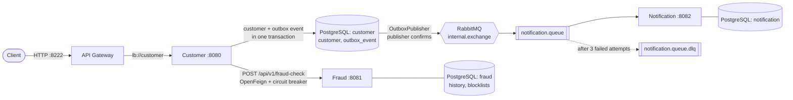
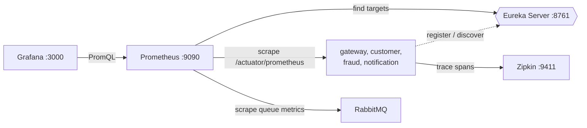

# Spring Cloud Microservices Platform

[](https://github.com/0xZinchenko/spring-microservices-platform/actions/workflows/ci.yml)

Event-driven microservices on **Spring Boot 4** and **Spring Cloud** with reliable messaging
(transactional outbox, DLQ, idempotent consumers), circuit breakers, distributed tracing and Testcontainers tests.

**Contents:** [Architecture](#architecture) · [How it works](#how-it-works) · [Observability](#observability) ·
[Metrics and dashboards](#metrics-and-dashboards) · [Getting started](#getting-started) ·
[Demo walkthrough](#demo-walkthrough) · [API](#api) · [Tests](#tests) · [Roadmap](#roadmap)

## Architecture

Registration flow:



Service discovery and observability:



<details>
<summary>Target architecture (reference, 2026-06-01)</summary>

The diagram below shows where the project is heading. Parts of it are not implemented yet
(MongoDB, Kafka, Config Server, Docker registry). See [Roadmap](#roadmap).


</details>

## How it works

When a customer registers, the `customer` service:
1. validates the request, checks that the email is not taken and saves the customer to its own PostgreSQL database;
2. calls `fraud` **synchronously** (OpenFeign, resolved through Eureka, protected by a circuit breaker)
   to check the email against the fraud rules;
3. if the check fails or `fraud` is unavailable, the whole registration is **rolled back**;
4. stores a notification event in the `outbox_event` table **in the same transaction** as the customer;
5. a scheduled publisher sends pending outbox events to RabbitMQ **asynchronously**,
   and `notification` consumes them and saves them.

### Transactional Outbox

Publishing to RabbitMQ directly after the commit can lose messages: the customer is already saved,
but if the broker is down at that moment the notification is gone. Instead:

- the event is written to `outbox_event` in the same database transaction as the customer,
  so either both are saved or neither is;
- `OutboxPublisher` polls unpublished events every second and marks them published only after
  RabbitMQ acknowledges them;
- if RabbitMQ is unavailable, the event stays in the table (`attempts` and `last_error` are updated)
  and is retried until it is delivered;
- messages are sent with **correlated publisher confirms** and the `mandatory` flag: if the broker
  rejects the message or it cannot be routed to any queue, the event is not marked as published;
- rows are selected with `FOR UPDATE SKIP LOCKED`, so several `customer` instances never send
  the same event twice at the same time;
- `OutboxCleanupService` runs every hour and deletes events that were **published** more than 7 days ago,
  in batches of 1000. Unpublished events are never deleted. Schedule, retention and batch size are
  configured under `outbox.cleanup` in `application.yml`.

Delivery is **at-least-once**: a message can be delivered more than once (for example, if the service
crashes after RabbitMQ confirmed the message but before the row was marked as published).
Each message carries a unique `messageId` (`customer-outbox-<id>`), which lets the consumer detect duplicates.

### Fraud rules

`fraud` rejects a customer when:

| Rule | Reason | Source |
|---|---|---|
| The email is on the blocklist | `BLOCKED_EMAIL` | table `blocked_email` |
| The email domain is a disposable email provider (`mailinator.com`, `yopmail.com`, …) | `DISPOSABLE_EMAIL_DOMAIN` | table `blocked_email_domain`, seeded by a Flyway migration |

Emails are compared case-insensitively. Every check is stored in `fraud_check_history` with its reason.
The client only gets `403 Registration rejected by the fraud check`: the matched rule is logged but not
returned, so the response does not tell how to bypass the check.

Block an email or a domain (for example, from pgAdmin, database `fraud`):

```sql
INSERT INTO blocked_email (email) VALUES ('someone@example.com');
INSERT INTO blocked_email_domain (domain) VALUES ('spam-domain.com');
```

### Retries, Dead Letter Queue and idempotency

- If `notification` fails to process a message, it is retried **3 times** with exponential backoff (1s, 2s).
- After the last attempt, or immediately for a malformed message, it is moved to the
  **Dead Letter Queue** `notification.queue.dlq` (via the `internal.dlx` exchange) instead of being
  redelivered forever. Messages in the DLQ can be inspected in the RabbitMQ UI.
- The consumer is **idempotent**: the `messageId` is stored as `source_message_id`, so a message that
  is delivered twice is skipped. A unique index on that column guards against concurrent duplicates.

## Observability

Every request gets a trace id that follows it through all services, including the asynchronous part:

```
gateway       SERVER    POST /api/v1/customers
  customer    SERVER    POST /api/v1/customers
    customer            circuit-breaker
      fraud   SERVER    POST /api/v1/fraud-check
    customer            outbox publish
      customer PRODUCER internal.exchange send
        notification CONSUMER notification.queue receive
```

- Open **Zipkin** at http://localhost:9411 and click *Run query* to see traces.
- Log lines contain `[service,traceId,spanId]`, so logs of one request can be found across services.
- Requests to `/actuator/**` (for example, Docker healthchecks) are not traced, so Zipkin only shows real traffic.
- The outbox stores the trace context (`traceparent` header) together with the event, and the publisher
  restores it. That is why the RabbitMQ part stays in the same trace, even though it is sent later by a
  scheduled job.
- Each service exposes `GET /actuator/health` and `GET /actuator/info`. Docker Compose uses the health
  endpoint for container healthchecks. The overall status still includes the database, RabbitMQ and
  discovery checks, but their details are hidden. To see them while debugging, start a service with
  `MANAGEMENT_ENDPOINT_HEALTH_SHOWDETAILS=always`.

## Metrics and dashboards

Prometheus and Grafana start with the `app` profile (`docker compose --profile app up -d --build`).

- Every service exposes metrics at `/actuator/prometheus`.
- **Prometheus finds the services through Eureka** (`eureka_sd_configs`), so a new instance is
  scraped automatically. It also scrapes RabbitMQ queue metrics. Check targets at
  http://localhost:9090/targets.
- **Grafana** opens the *Microservices overview* dashboard at http://localhost:3000 without login.
  The data source and the dashboard are provisioned from [`docker/grafana`](docker/grafana).

| Row | Panels |
|---|---|
| Traffic | Requests per second, 5xx errors per second, p95 latency (per service) |
| Business | Registrations by result, fraud checks by result, notifications processed |
| Reliability | Outbox pending events, outbox publish failures, dead letter queue size, fraud circuit breaker state |
| JVM | Heap used, CPU usage (per service) |

Custom metrics:

| Metric | Service | Tags |
|---|---|---|
| `customer_registrations_total` | customer | `result`: success, invalid, duplicate, fraud, fraud_unavailable |
| `outbox_events_pending` | customer | — |
| `outbox_events_published_total`, `outbox_publish_failures_total` | customer | — |
| `fraud_checks_total` | fraud | `result`: clean, blocked_email, disposable_email_domain |
| `notifications_processed_total` | notification | `result`: saved, duplicate |

All counters are registered with `0` at startup, so Prometheus sees the first increase and panels show
`0` instead of *No data*.

## Tech stack

| Area | Technology |
|---|---|
| Language | Java 17 |
| Framework | Spring Boot 4.0.8, Spring Cloud 2025.1.3 |
| Service discovery | Spring Cloud Netflix Eureka |
| API gateway | Spring Cloud Gateway |
| Inter-service calls | Spring Cloud OpenFeign |
| Fault tolerance | Resilience4j (circuit breaker, time limiter) |
| Observability | Spring Boot Actuator, Micrometer Tracing (Brave), Zipkin, Prometheus, Grafana |
| Messaging | RabbitMQ 4.3 (Spring AMQP) |
| Persistence | PostgreSQL 18, Spring Data JPA / Hibernate |
| Database migrations | Flyway |
| Validation | Jakarta Bean Validation |
| API documentation | springdoc-openapi (Swagger UI) |
| Testing | JUnit 5, Mockito, AssertJ, Spring MockMvc, Testcontainers 2 |
| Build | Maven (multi-module) |
| Infrastructure | Docker (multi-stage build), Docker Compose |
| Other | Lombok |

## Modules

| Module | Purpose | Port |
|---|---|---|
| `eureka-server` | Service registry | 8761 |
| `gateway` | Single entry point, routes `/api/v1/customers/**` to `customer` | 8222 |
| `customer` | Customer registration, calls `fraud`, publishes notification events | 8080 |
| `fraud` | Fraud check, stores check history | 8081 |
| `notification` | Consumes events from RabbitMQ, stores notifications | 8082 |
| `clients` | Shared library: Feign clients and DTOs (not a runnable service) | — |

Infrastructure (from `docker-compose.yml`):

| Service | URL / port | Credentials |
|---|---|---|
| PostgreSQL | `localhost:5432` | `POSTGRES_USER` / `POSTGRES_PASSWORD` |
| pgAdmin | http://localhost:5050 | `PGADMIN_DEFAULT_EMAIL` / `PGADMIN_DEFAULT_PASSWORD` |
| RabbitMQ | `localhost:5672` | `RABBITMQ_USER` / `RABBITMQ_PASSWORD` |
| RabbitMQ Management UI | http://localhost:15672 | `RABBITMQ_USER` / `RABBITMQ_PASSWORD` |
| Zipkin | http://localhost:9411 | — |
| Prometheus | http://localhost:9090 | — |
| Grafana | http://localhost:3000 | anonymous read-only; admin: `GRAFANA_ADMIN_USER` / `GRAFANA_ADMIN_PASSWORD` |

Credentials are not stored in the repository. They live in a local `.env` file (ignored by git and
excluded from Docker images), created from [`.env.example`](.env.example).

## Project structure

Each service is split into layered packages:

```
customer/src/main/
├── java/com/zim4ik/customer/
│   ├── CustomerApplication.java
│   ├── config/        RabbitMQ message converter
│   ├── controller/    REST endpoints
│   ├── dto/           request / response records
│   ├── entity/        JPA entities
│   ├── event/         application events and listeners
│   ├── exception/     custom exceptions and @RestControllerAdvice
│   ├── rabbitmq/      outbox publisher
│   ├── repository/    Spring Data repositories
│   └── service/       business logic
└── resources/
    ├── application.yml
    └── db/migration/  Flyway SQL migrations
```

`fraud` and `notification` follow the same layout.

## Getting started

### Prerequisites

- Docker with Docker Compose
- JDK 17 and Maven 3.9+ (only for running services locally, outside Docker)

### Configure credentials

```bash
cp .env.example .env
```

Then change the passwords in `.env`. The same file is used by Docker Compose and by services started
locally (they import it with `spring.config.import`). `./start-dev.sh` creates `.env` automatically
if it does not exist. Tests do not need it: Testcontainers provides its own credentials.

### Option 1: everything in Docker

```bash
docker compose --profile app up -d --build
```

This builds an image for each service from the shared multi-stage [`Dockerfile`](Dockerfile)
and starts them together with PostgreSQL and RabbitMQ. Images run on a small Alpine-based Java 17
runtime (BellSoft Liberica, amd64 and arm64) as a non-root user, and the Spring Boot jar is split into
layers, so a code change only rebuilds the small application layer. Services wait for Postgres, RabbitMQ and
Eureka to become healthy before starting. Give them ~30 seconds after startup to discover each other
through Eureka; until then registration may return `503`.

Stop everything:

```bash
docker compose --profile app down
```

### Option 2: infrastructure in Docker, services locally

Useful while developing: run services from the IDE or Maven and only the infrastructure in Docker.

#### 1. Start the infrastructure

```bash
docker compose up -d
```

On the first start, PostgreSQL creates the `customer`, `fraud` and `notification` databases
from [`docker/postgres/init.sql`](docker/postgres/init.sql).

> The init script runs **only when the volume is empty**. If you already had the `postgres` volume
> before this script was added, either create the databases manually in pgAdmin or recreate the volume:
> `docker compose down -v && docker compose up -d` (this deletes all data).
>
> If a `rabbitmq` container from an older version of the project is still running, recreate it
> (`docker compose up -d --force-recreate rabbitmq`): `notification.queue` now has dead-letter
> arguments, and RabbitMQ refuses to redeclare an existing queue with different arguments.
>
> Tables are created by Flyway on service startup. If the databases still contain tables from the
> old `create-drop` setup, Flyway refuses to run: recreate the volume with the command above.

#### 2. Build the project

```bash
mvn clean install -DskipTests
```

#### 3. Run the services

Option A: script (starts Eureka, fraud, notification and customer):

```bash
./start-dev.sh
```

Then start the gateway in a separate terminal:

```bash
mvn spring-boot:run -pl gateway
```

Option B: start each service manually, **Eureka first**:

```bash
mvn spring-boot:run -pl eureka-server
mvn spring-boot:run -pl fraud
mvn spring-boot:run -pl notification
mvn spring-boot:run -pl customer
mvn spring-boot:run -pl gateway
```

## Usage

Register a customer through the gateway:

```bash
curl -i -X POST http://localhost:8222/api/v1/customers \
  -H "Content-Type: application/json" \
  -d '{"firstName":"Yan","lastName":"Zinchenko","email":"yan@example.com"}'
```

Expected response: `201 Created`

```json
{"customerId":1}
```

Possible error responses (in [RFC 7807](https://www.rfc-editor.org/rfc/rfc7807) `ProblemDetail` format):

| Status | When |
|---|---|
| `400 Bad Request` | Validation failed; the `errors` field lists the invalid fields |
| `403 Forbidden` | The customer did not pass the fraud check |
| `409 Conflict` | A customer with this email already exists (emails are compared case-insensitively) |
| `503 Service Unavailable` | `fraud` is down, too slow, or the circuit breaker is open |

```json
{
  "title": "Bad Request",
  "status": 400,
  "detail": "Request validation failed",
  "errors": {
    "firstName": "must not be blank",
    "email": "must be a well-formed email address"
  }
}
```

Check the fraud service directly:

```bash
curl -X POST http://localhost:8081/api/v1/fraud-check \
  -H "Content-Type: application/json" \
  -d '{"customerId":1,"email":"someone@mailinator.com"}'
# {"isFraudster":true,"reason":"DISPOSABLE_EMAIL_DOMAIN"}
```

Try the `403` through the gateway with a disposable email, for example `spam@mailinator.com`.

## Demo walkthrough

A 10-minute tour of every feature. Start everything first:

```bash
cp .env.example .env                        # once
docker compose --profile app up -d --build
docker compose --profile app ps             # wait until services are (healthy)
```

Give the services ~30 seconds to find each other through Eureka (http://localhost:8761).

**1. Register customers and see every response** (or use Swagger UI: http://localhost:8080/swagger-ui.html)

```bash
URL=localhost:8222/api/v1/customers; H="Content-Type: application/json"
curl -i -X POST $URL -H "$H" -d '{"firstName":"Yan","lastName":"Zinchenko","email":"yan@example.com"}'   # 201
curl -i -X POST $URL -H "$H" -d '{"firstName":"Yan","lastName":"Z","email":"YAN@example.com"}'          # 409 duplicate
curl -i -X POST $URL -H "$H" -d '{"firstName":"Spam","lastName":"Bot","email":"spam@mailinator.com"}'   # 403 fraud
curl -i -X POST $URL -H "$H" -d '{"firstName":"","lastName":"Z","email":"bad"}'                         # 400 invalid
```

**2. Look at the data** (`POSTGRES_USER` from `.env`)

```bash
docker exec postgres psql -U zim4ik -d customer     -c "select id, email from customer"
docker exec postgres psql -U zim4ik -d customer     -c "select id, published_at, attempts from outbox_event"
docker exec postgres psql -U zim4ik -d fraud        -c "select customer_id, is_fraudster, reason from fraud_check_history"
docker exec postgres psql -U zim4ik -d notification -c "select to_customer_email, message from notification"
```

Only the successful registration is stored; the fraud history keeps every check with its reason.

**3. Follow a request** in Zipkin (http://localhost:9411 → *Run query*): gateway → customer → fraud →
outbox → RabbitMQ → notification in one trace.

**4. Watch the metrics** in Grafana (http://localhost:3000): send a few more requests and check
*Registrations by result* and *Fraud checks by result*.

**5. Break the fraud service**

```bash
docker stop fraud
# send 6-8 registrations with different emails -> 503
docker start fraud
```

Registrations return `503` and nothing is saved. In Grafana, *Fraud circuit breaker* turns **OPEN**
and *Registrations by result* shows `fraud_unavailable`.

**6. Break RabbitMQ**

```bash
docker stop rabbitmq
curl -i -X POST $URL -H "$H" -d '{"firstName":"Anna","lastName":"K","email":"anna@example.com"}'        # still 201
docker exec postgres psql -U zim4ik -d customer -c "select id, published_at, attempts, last_error from outbox_event order by id desc limit 1"
docker start rabbitmq
```

The event waits in the outbox (`published_at` is empty, `attempts` grows, *Outbox pending* > 0 in Grafana).
After RabbitMQ is back, it is delivered and Anna's notification appears. Nothing is lost.

**7. Clean up**

```bash
docker compose --profile app down -v
```

## API

| Method | Path | Service | Description |
|---|---|---|---|
| `POST` | `/api/v1/customers` | customer (via gateway) | Register a customer |
| `POST` | `/api/v1/fraud-check` | fraud | Check a customer (`customerId`, `email`) against the fraud rules |

Interactive documentation (Swagger UI, generated with springdoc-openapi):

| Service | Swagger UI | OpenAPI spec |
|---|---|---|
| customer | http://localhost:8080/swagger-ui.html | http://localhost:8080/v3/api-docs |
| fraud | http://localhost:8081/swagger-ui.html | http://localhost:8081/v3/api-docs |

In Swagger UI, open *Customers → POST /api/v1/customers → Try it out* to register a customer with
the example request and see every possible response (`201`, `400`, `403`, `409`, `503`).

## Tests

```bash
mvn test
```

Docker must be running: integration tests start real PostgreSQL and RabbitMQ containers with Testcontainers.

On every push and pull request to `main`, [GitHub Actions](.github/workflows/ci.yml) runs the tests
and builds the Docker images.

| Service | Test | What it checks |
|---|---|---|
| customer | `CustomerServiceTest` | Registration logic with mocked dependencies |
| customer | `CustomerControllerTest` | HTTP statuses `201`, `400`, `403`, `409`, `503` and error bodies |
| customer | `CustomerRegistrationIntegrationTest` | OpenAPI spec is generated with all responses; full flow on Postgres + RabbitMQ: customer and outbox event saved together, notification delivered, retry when the broker rejects the message or it is unroutable, trace context propagated to RabbitMQ, rollback when the customer is a fraudster or `fraud` fails, duplicate email rejected |
| customer | `OutboxEventRepositoryTest` | Outbox SQL on Postgres: locking unpublished events, deleting only old published events in batches |
| customer | `OutboxCleanupServiceTest` | Cleanup cutoff date and batch loop |
| customer | `OutboxPublisherTest` | Message format, publisher confirms (ack / nack), recording failed attempts |
| fraud | `FraudCheckServiceTest` | Fraud rules: clean email, blocked email, disposable domain; history record |
| fraud | `FraudCheckIntegrationTest` | Endpoint on Postgres: seeded disposable domains, blocklist, validation, history with reason |
| notification | `NotificationServiceTest` | Notification mapping and skipping duplicates |
| notification | `NotificationConsumerIntegrationTest` | Message from RabbitMQ is stored in Postgres, duplicates are ignored, failing and malformed messages end up in the DLQ |

## Known limitations

- Fraud blocklists are managed with SQL; there is no admin API for them yet.
- The gateway only routes `customer`; `fraud` and `notification` are internal services.
- `notification` has a `spring.zipkin` setting, but Zipkin is not in the dependencies or in Docker Compose.

## Roadmap

- [ ] Centralized configuration (Spring Cloud Config)
- [ ] Kubernetes deployment
- [x] Metrics with Prometheus and Grafana dashboards
- [x] Unit and integration tests (Testcontainers)
- [x] Dockerfile for every service and the full stack in Docker Compose
- [x] Database migrations (Flyway) instead of `create-drop`
- [x] Service discovery for Feign clients through Eureka
- [x] Circuit breaker and timeouts for inter-service calls
- [x] Request validation and consistent error responses
- [x] Transactional registration: no customer is saved if the fraud check fails
- [x] Transactional Outbox for reliable event publishing
- [x] Retries, Dead Letter Queue and idempotent consumer
- [x] Unique customer email with `409 Conflict`
- [x] Fraud rules: email blocklist and disposable email domains
- [x] Distributed tracing (Micrometer Tracing + Zipkin) and Actuator health checks

## Author

**Yan Zinchenko**, [GitHub @0xZinchenko](https://github.com/0xZinchenko)
