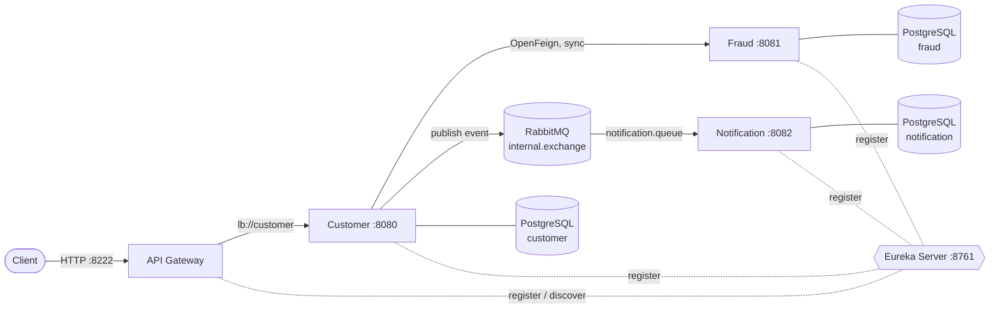

# Spring Cloud Microservices Platform

A learning project that shows a microservice architecture built with **Spring Boot 3** and **Spring Cloud**:
service discovery, an API gateway, synchronous calls through OpenFeign and asynchronous messaging over RabbitMQ.

When a customer registers, the `customer` service:
1. validates the request and saves the customer to its own PostgreSQL database;
2. calls `fraud` **synchronously** (OpenFeign, resolved through Eureka, protected by a circuit breaker);
3. if the check fails or `fraud` is unavailable, the whole registration is **rolled back**;
4. after the transaction commits, publishes a notification event to RabbitMQ **asynchronously**,
   and `notification` consumes it and saves it.

## Architecture



<details>
<summary>Target architecture (reference, 2026-06-01)</summary>

The diagram below shows where the project is heading. Parts of it are not implemented yet
(MongoDB, Kafka, Config Server, Zipkin, Docker registry). See [Roadmap](#roadmap).


</details>

## Tech stack

| Area | Technology |
|---|---|
| Language | Java 17 |
| Framework | Spring Boot 3.3.2, Spring Cloud 2023.0.3 |
| Service discovery | Spring Cloud Netflix Eureka |
| API gateway | Spring Cloud Gateway |
| Inter-service calls | Spring Cloud OpenFeign |
| Fault tolerance | Resilience4j (circuit breaker, time limiter) |
| Messaging | RabbitMQ 3.12 (Spring AMQP) |
| Persistence | PostgreSQL, Spring Data JPA / Hibernate |
| Database migrations | Flyway |
| Validation | Jakarta Bean Validation |
| Build | Maven (multi-module) |
| Infrastructure | Docker (multi-stage build), Docker Compose |
| Other | Lombok |

## Modules

| Module | Purpose | Port |
|---|---|---|
| `eureka-server` | Service registry | 8761 |
| `gateway` | Single entry point, routes `/api/v1/customers/**` to `customer` | 8222 |
| `customer` | Customer registration, calls `fraud`, publishes notification events | 8080 |
| `fraud` | Fraud check, stores check history | 8081 |
| `notification` | Consumes events from RabbitMQ, stores notifications | 8082 |
| `clients` | Shared library: Feign clients and DTOs (not a runnable service) | — |

Infrastructure (from `docker-compose.yml`):

| Service | URL / port | Credentials |
|---|---|---|
| PostgreSQL | `localhost:5432` | `zim4ik` / `password` |
| pgAdmin | http://localhost:5050 | `pgadmin@admin.com` / `admin` |
| RabbitMQ | `localhost:5672` | `guest` / `guest` |
| RabbitMQ Management UI | http://localhost:15672 | `guest` / `guest` |

> These credentials are for local development only.

## Project structure

Each service is split into layered packages:

```
customer/src/main/
├── java/com/zim4ik/customer/
│   ├── CustomerApplication.java
│   ├── config/        RabbitMQ message converter
│   ├── controller/    REST endpoints
│   ├── dto/           request / response records
│   ├── entity/        JPA entities
│   ├── event/         application events
│   ├── exception/     custom exceptions and @RestControllerAdvice
│   ├── rabbitmq/      message producer and event listener
│   ├── repository/    Spring Data repositories
│   └── service/       business logic
└── resources/
    ├── application.yml
    └── db/migration/  Flyway SQL migrations
```

`fraud` and `notification` follow the same layout.

## Getting started

### Prerequisites

- Docker with Docker Compose
- JDK 17 and Maven 3.9+ (only for running services locally, outside Docker)

### Option 1: everything in Docker

```bash
docker compose --profile app up -d --build
```

This builds an image for each service from the shared multi-stage [`Dockerfile`](Dockerfile)
and starts them together with PostgreSQL and RabbitMQ. Services wait for Postgres, RabbitMQ and
Eureka to become healthy before starting. Give them ~30 seconds after startup to discover each other
through Eureka; until then registration may return `503`.

Stop everything:

```bash
docker compose --profile app down
```

### Option 2: infrastructure in Docker, services locally

Useful while developing: run services from the IDE or Maven and only the infrastructure in Docker.

#### 1. Start the infrastructure

```bash
docker compose up -d
```

On the first start, PostgreSQL creates the `customer`, `fraud` and `notification` databases
from [`docker/postgres/init.sql`](docker/postgres/init.sql).

> The init script runs **only when the volume is empty**. If you already had the `postgres` volume
> before this script was added, either create the databases manually in pgAdmin or recreate the volume:
> `docker compose down -v && docker compose up -d` (this deletes all data).
>
> Tables are created by Flyway on service startup. If the databases still contain tables from the
> old `create-drop` setup, Flyway refuses to run: recreate the volume with the command above.

#### 2. Build the project

```bash
mvn clean install -DskipTests
```

#### 3. Run the services

Option A: script (starts Eureka, fraud, notification and customer):

```bash
./start-dev.sh
```

Then start the gateway in a separate terminal:

```bash
mvn spring-boot:run -pl gateway
```

Option B: start each service manually, **Eureka first**:

```bash
mvn spring-boot:run -pl eureka-server
mvn spring-boot:run -pl fraud
mvn spring-boot:run -pl notification
mvn spring-boot:run -pl customer
mvn spring-boot:run -pl gateway
```

## Usage

Register a customer through the gateway:

```bash
curl -i -X POST http://localhost:8222/api/v1/customers \
  -H "Content-Type: application/json" \
  -d '{"firstName":"Yan","lastName":"Zinchenko","email":"yan@example.com"}'
```

Expected response: `201 Created`

```json
{"customerId":1}
```

Possible error responses (in [RFC 7807](https://www.rfc-editor.org/rfc/rfc7807) `ProblemDetail` format):

| Status | When |
|---|---|
| `400 Bad Request` | Validation failed; the `errors` field lists the invalid fields |
| `403 Forbidden` | The customer did not pass the fraud check |
| `503 Service Unavailable` | `fraud` is down, too slow, or the circuit breaker is open |

```json
{
  "title": "Bad Request",
  "status": 400,
  "detail": "Request validation failed",
  "errors": {
    "firstName": "must not be blank",
    "email": "must be a well-formed email address"
  }
}
```

Check the fraud service directly:

```bash
curl http://localhost:8081/api/v1/fraud-check/1
# {"isFraudster":false}
```

### How to verify the flow

- **Eureka dashboard** (http://localhost:8761): `CUSTOMER`, `FRAUD`, `NOTIFICATION` and `GATEWAY` are registered.
- **RabbitMQ UI** (http://localhost:15672): the `notification.queue` queue is bound to `internal.exchange`.
- **pgAdmin** (http://localhost:5050):
  - `customer` database has the new customer;
  - `fraud` database has a row in `fraud_check_history`;
  - `notification` database has a welcome notification.
- **Logs**: `customer` prints `Notification event sent`, `notification` prints `Received from queue`.

## API

| Method | Path | Service | Description |
|---|---|---|---|
| `POST` | `/api/v1/customers` | customer (via gateway) | Register a customer |
| `GET` | `/api/v1/fraud-check/{customerId}` | fraud | Check if a customer is a fraudster |
| `POST` | `/api/v1/notification` | notification | Send a notification directly (sync, bypasses RabbitMQ) |

## Known limitations

- `FraudCheckService` is a stub: it always returns `isFraudster = false`, so `403` is never returned yet.
- The gateway only routes `customer`; `fraud` and `notification` are internal services.
- `notification` has a `spring.zipkin` setting, but Zipkin is not in the dependencies or in Docker Compose.
- No tests yet.
- Credentials are hardcoded in `application.yml` (fine for local dev only).

## Roadmap

- [ ] Real fraud-check logic
- [ ] Distributed tracing (Micrometer Tracing + Zipkin)
- [ ] Centralized configuration (Spring Cloud Config)
- [ ] Unit and integration tests (Testcontainers)
- [ ] Kubernetes deployment
- [x] Dockerfile for every service and the full stack in Docker Compose
- [x] Database migrations (Flyway) instead of `create-drop`
- [x] Service discovery for Feign clients through Eureka
- [x] Circuit breaker and timeouts for inter-service calls
- [x] Request validation and consistent error responses
- [x] Transactional registration: no customer is saved if the fraud check fails

## Author

**Yan Zinchenko**, [GitHub @0xZinchenko](https://github.com/0xZinchenko)
